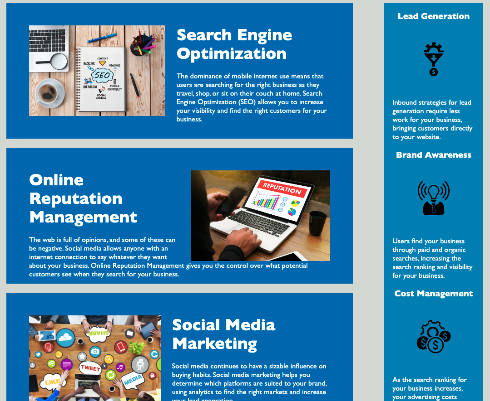

# horiseon-homepage-refactor

## Description

Horiseon is a marketing agency specializing in search engine optimization, online reputation management, and social media marketing. Horiseon wants a codebase "that follows accessibilty standards so that their site is optimized for search engines.

This code includes updates to the html and css code to better inform browsers and search engines what this website is about. It consolidates code and allows for better accessibility. 

## Installation

Be able to access .html and .css files and run the files to view website in browser. 

## Usage

The html code now includes a descritptive title in the head section called "Horiseon: Search Engine Optimization, Online Reputaion Management, and Social Media Marketing". When users search for sites with content like Horiseon, this allows for better ranking in search results which will lead to more traffic. 

Code utilizes semantic html elements for easy reading and replication. Use aside section for a sidebar and main sections for similar descriptions of subject of the website.

Avoids any potentials for being marked as spam by Google and search engines since code is now descriptive as to what the Horiseon website provides. 

## License

MIT License

Copyright (c) 2022 mardill

Permission is hereby granted, free of charge, to any person obtaining a copy
of this software and associated documentation files (the "Software"), to deal
in the Software without restriction, including without limitation the rights
to use, copy, modify, merge, publish, distribute, sublicense, and/or sell
copies of the Software, and to permit persons to whom the Software is
furnished to do so, subject to the following conditions:

The above copyright notice and this permission notice shall be included in all
copies or substantial portions of the Software.

THE SOFTWARE IS PROVIDED "AS IS", WITHOUT WARRANTY OF ANY KIND, EXPRESS OR
IMPLIED, INCLUDING BUT NOT LIMITED TO THE WARRANTIES OF MERCHANTABILITY,
FITNESS FOR A PARTICULAR PURPOSE AND NONINFRINGEMENT. IN NO EVENT SHALL THE
AUTHORS OR COPYRIGHT HOLDERS BE LIABLE FOR ANY CLAIM, DAMAGES OR OTHER
LIABILITY, WHETHER IN AN ACTION OF CONTRACT, TORT OR OTHERWISE, ARISING FROM,
OUT OF OR IN CONNECTION WITH THE SOFTWARE OR THE USE OR OTHER DEALINGS IN THE
SOFTWARE.